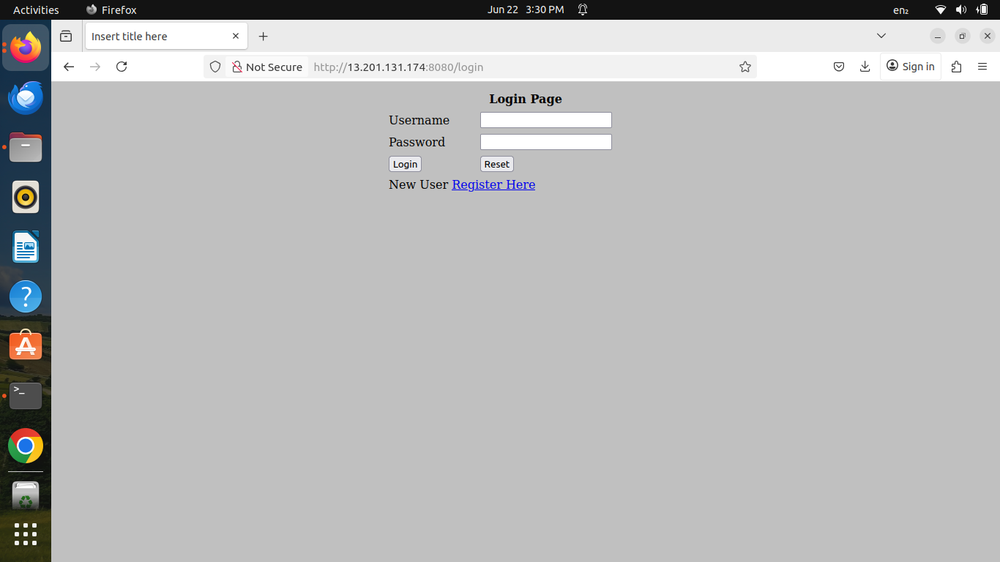

# Java DevOps 3-Tier Project

This project demonstrates a complete DevOps pipeline for a Java Spring Boot web application (Login/Register system) using Docker, Jenkins, Terraform, Kubernetes, and GitHub. It follows a 3-tier architecture and is ideal for showcasing in resumes or interviews.

---

## 📁 Project Structure
```
java-devops-3tier/
├── Java-Login-App/         # Spring Boot application
│   ├── src/                # Java source code and JSP pages
│   ├── pom.xml             # Maven configuration
│   └── Dockerfile          # Docker container setup
├── Jenkinsfile             # Jenkins CI/CD pipeline
├── docker-compose.yml      # App + MySQL local setup
├── terraform/             # AWS EC2 provisioning
│   └── main.tf
├── k8s/                   # Kubernetes manifests
│   ├── deployment.yaml
│   └── service.yaml
└── README.md              # Project overview
```

---

## 🚀 Tech Stack
- **Backend**: Java, Spring Boot, JSP
- **Build Tool**: Maven
- **CI/CD**: Jenkins
- **Containerization**: Docker
- **Orchestration**: Kubernetes (K8s)
- **Infrastructure as Code**: Terraform
- **Database**: MySQL (via Docker Compose)
- **Hosting**: AWS EC2 (via Terraform)

---

## ⚙️ DevOps Pipeline Overview
1. **Build Spring Boot App** with Maven
2. **Dockerize** app using `Dockerfile`
3. **Push code to GitHub**
4. **Jenkins** pulls repo and builds Docker image
5. **Terraform** creates EC2 instance
6. **Docker Run** or **Kubernetes Deployment** launches app

---

## 🐳 Docker Commands
```bash
cd Java-Login-App
mvn clean package
docker build -t java-login-app .
docker run -d -p 8080:8080 java-login-app
```

---

## 🐙 Docker Compose (Local Setup)
```bash
docker-compose up --build
```

---

## ☁️ Deploy to AWS EC2 using Terraform
```bash
cd terraform
terraform init
terraform apply
```
> Replace `your-key-name` in `main.tf` with your EC2 Key Pair.

---

## ☸️ Deploy to Kubernetes
```bash
kubectl apply -f k8s/deployment.yaml
kubectl apply -f k8s/service.yaml
```
---

## 🖼️ Project Screenshot

Here is a preview of the login page:



---

## ✅ Author
**Chaitanya Sai Chennamsetty**  
GitHub: [@chaitanyachennamsetty](https://github.com/chaitanyachennamsetty)

---

## 📄 License
This project is for educational and portfolio purposes.
